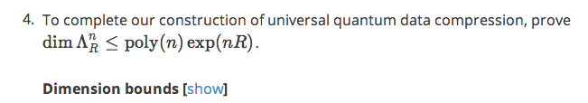

latex2edx TeX Macros
====================

latex2edx takes a latex file as input, and generates as output XML
files for an edX course.  The output may also include JSON files which
specify start, end, and due dates for course content.

The edX XML file format is `documented separately <http://edx.readthedocs.org/en/latest/course_data_formats/course_xml.html>`_.

The latex files should employ a special set of TeX macros, to specify
the course structure (course, chapter, section, vertical, sequential)
and the content elements (video, text, problem, discussion).  

Problem elements should also include special macros to specify
interactive questions, via "answer boxes," defined using an "abox"
macro.  Answer boxes come in many forms, defining e.g. multiple
choice, option list, numerical, string, formula, image, javascript,
drag-and-drop, and custom response questions.

Some auxilliary macros may also be used, e.g. to define solution text
(shown when problems are done), and to indicate inclusion of external
XML, or python code.  Auxilliary macros also include some used for
fine-tuning of layout, e.g. specifying text which is to be inline with
answer boxes, and boxes of text which may be optionally shown or
hidden.

In the documentation below, macros are specified as being one of two
types.  *Environment* macros are used as::

  \begin{MacroName}
  ...
  \end{MacroName}

whereas *Command* macros are used as::

  \MacroName{...}

Structural Macros
-----------------

edX courses are structured heirarchically, by chapter, sequential (or section), then
vertical.  Each sequential unit may have several Vertical elements
within it.  In addition, the course itself is defined with certain properties.

.. image:: images/course-structure-labeled.png

These are the structural macros defined for use in latex2edx:

============== =========== ============================================================
Macro Name     Type        Arguments
============== =========== ============================================================
edXcourse      Environment { course_number } { display_name } [ attributes ]
edXchapter     Environment { display_name } [ attributes ]
edXsection     Environment { display_name } [ attributes ]
edXsequential  Environment { display_name } [ attributes ]
edXvertical    Environment { display_name } [ attributes ]
edXconditional Environment { display_name } [ attributes ]
============== =========== ============================================================

The edXchapter, edXsection, edXsequential, and edXvertical macros also
exist in starred versions (e.g. ``edXchapter*``), which in agreement
with standard LaTeX notation stand for unnumbered sections.

Each of these macros may have optional "attributes" defined, which
specify content metadata.  Each "attributes" string should be a
sequence of ``key=value`` separated by spaces.  If ``value`` has
spaces, then it should be quoted (with double-quotes).

Some attributes are special and specific to each macro.  The following
common attributes may be used with any of these macros:

======== =========================================================================
Key      Value
======== =========================================================================
url_name Unique database ID key; also used in the XML as the filename prefix
start    Start date, specifying when content is made visible to students
======== =========================================================================

``url_name`` is handy to specify, since it fixes the name of the file
which is generated for the element, in the output XML, if the element is a
separate file.  For example, in the output XML, each chapter is
separate file, as generated by latex2edx.  Problem, text, and video
elements are also each stored as individual XML files in the
output XML.

Note that ``url_name`` may only contain uppercase and lowercase
letters, numbers, and the underbar character (``_``).  It may not
contain other characters; in particular, no spaces, dashes, or periods
are allowed.

Also be aware that the ``edXsection`` Environment is replaced by
``edXsequential``.

edXcourse
^^^^^^^^^

This macro defines the course; it is the highest level container,
should only be used once within the latex files input to latex2edx.

Example::

    \begin{edXcourse}{1.00x}{Introduction to latex2edx}[url_name=2013_Fall showanswer=always start=2014-05-11T12:00]
    ...
    \end{edXcourse}

Each course needs a course number (e.g. ``1.00x``) and a name (e.g. ``Introduction to latex2edx``).

It is conventional to also specify the ``url_name`` for a course, as
being the semester in which the course is run.

edXchapter
^^^^^^^^^^

This is the second highest level container element.  Each chapter
appears in an edX course as a high-level block in the left-hand
navigator, when using edX platform to render edX XML.

Example::

    \begin{edXchapter}{Unit 2}[start="2013-11-22"]
    ...
    \end{edXchapter}

It is convenient (and often conventional) to think of each chapter as
being one week of the course.

Chapters should be within a course.

edXsection
^^^^^^^^^^

Example::

    \begin{edXsection}{A second section}[due="2016-11-22 13:30" graded=true]
    ...
    \end{edXsection}

Each section may have specified a "due" attribute; this specifies the
date upon which problems within the section are due, i.e. they must be
submitted before the due date.  The format is "year-month-day
hour:minute".  

Each section may also have specified a boolean flag "graded", which
indicates whether problems within the section are to count towards an
assignment (an aggregated set of problems) or not.

Sections should be within a chapter.

edXvertical
^^^^^^^^^^^

Eample::

    \begin{edXvertical}
    ...
    \end{edXvertical}

A vertical element groups a set of one or more text, video, and
problem elements together, such that they are displayed as one
vertical unit, when using the edX platform to render edX course
content.

edXconditional
^^^^^^^^^^^^^^

Eample::

    \begin{edXconditional}{Concept Question 1 - Explanation}[sources=i4x://MITx/8.421.1x/problem/problem_Concept_Question_1 attempted=True message="Please do Concept Question 1 first, then refresh the page to show this explanation."]

      \edXvideo{Concept Question 1: Video Explanation}{SomeYTID}

    \end{edXconditional}

A conditional element displays its contents only when certain
conditions are satisfied.  The "attempted", "submitted", and "correct" conditions apply to CAPA
problems.  "poll_answer" and "voted" apply to poll_questions.

Content Macros
--------------

============= =========== ============================================================
Macro Name    Type        Arguments
============= =========== ============================================================
edXproblem    Environment { display_name }{ attributes }
edXtext       Environment { display_name } [ attributes ]
edXvideo      Command     { display_name } { youtube_id } [ attrib_string ] 
edXlti        Command     { display_name } { launch_url } { lti_id } [ attrib_string ] 
edXdiscussion Command     { topic_name } [ attrib_string ] 
============= =========== ============================================================

edXproblem
^^^^^^^^^^

A problem is the central interactive element of an edX course.  It
provides a document with interactive questions (specified by
``edXabox`` "answer boxes").  

Example::

    \begin{edXproblem}{Example problem with hints}{url_name="p1" attempts=10 weight=5}
    ...
    \end{edXproblem}

Note that the attributes for an ``edXproblem`` are *mandatory*.
This is because basic metadata about a problem, such as the number of
allowed attempts, or the total number of points, need to be defined
for an edXproblem.  

Because attributes to ``edXproblem`` are mandatory, they are specified
in curly braces, ``{}``, instead of square braces, as is cannonical
elsewhere.

Allowed attributes for ``edXproblem`` include:

========== =========================================================================
Key        Value
========== =========================================================================
url_name   Unique database ID key; also used in the XML as the filename prefix
attempts   number of allowed attempts (set to zero, for a survey problem)
weight     total number of points to award for this problem
showanswer when to show answer, e.g. after due, when corrrect, etc. (see edX docs)
========== =========================================================================

A problem may be within a sequential or vertical; it cannot be placed
directly within a chapter (or unpredictable things may happen).

Complete example::

  \begin{edXproblem}{Numerical response}{}
  \section{Example of numerical response}  
  
  What is the numerical value of $\pi$?
  
  \edXabox{expect="3.14159" type="numerical" tolerance='0.01' }
  \end{edXproblem}

edXtext
^^^^^^^

A "text" element is a static HTML page.

Example::

    \begin{edXtext}{The Magna Carta}[url_name="magna_carta"]

    {\Large The Magna Carta and $\gamma=\sqrt{\alpha+1}$}
    ...
    \end{edXtext}

Note that unlike a problem, text elements do not automatically begin
with the ``display_name`` shown as a header, in the displayed
content (so it goes with edX platform).  Thus, it is typical to show
titles by hand.  This is not unreasonable, as the ``display_name``
string cannot contain math, whereas sometimes it is desirable for the
header to contain math, e.g. as in the example.

A text element may be within a sequential or vertical, placed in
parallel with problem and video.

edXvideo
^^^^^^^^

A video element embeds a YouTube video player in the course.

Example::

    \edXvideo{A sample video}{u23ZUSu7-HY}[source="https://s3.amazonaws.com/edx-course/video/mit-xxx/MITxxxTxxx-Gxxxx.mp4"]

The embeded player displays the video from YouTube 
(``https://www.youtube.com/watch?v=u23ZUSu7-HY``) 
for the example above. With a "Download video" button linking to 
``https://s3.amazonaws.com/edx-course/video/mit-xxx/MITxxxTxxx-Gxxxx.mp4`` 
specified by the optional ``source`` attribute.

To use non-YouTube video sources, provide a URL in place of the YouTube ID, e.g.::

    \edXvideo{A sample video}{https://my_video_server/a_video.mp4}

A video element may be within a sequential or vertical, placed in
parallel with problem and text.  A video element may also be placed inside a conditional.

edXlti
^^^^^^

A LTI element embeds a third-party LTI provider tool, hosted on an external website, in the course.

Example::

    \edXlti{Textbook: Classical Resonnance}{http://textbook_lti_provider}{the_lti_id}[open_in_a_new_page="false" custom_page=Introduction custom_section=2 url_name="The_Textbook"]

The first argument specifies the URL for the LTI provider site.

The second argument specifies the ID of the LTI tool, as defined in
the "lti_passports" entry of the edX policy file for the course.  That
entry is used to define authentication information for LTI tool
access, e.g. the consumer key.  For example::

        ...

        "lti_passports": [
            "the_lti_id:__consumer_key__:a_secret_key"
        ], 

	...

Optional arguments which may be specified include "open_in_a_new_page"
and "custom_*" keys.  Custom keys are transformed by latex2edx into
the "custom_parameters" field expected in edX XML.

For example, the above edXlti statement compiles to produce this XML:

      <lti display_name="Textbook: Classical Resonnance" launch_url="http://textbook_lti_provider" lti_id="the_lti_id" open_in_a_new_page="false" url_name="The_Textbook" custom_parameters="[&quot;page=Introduction&quot;, &quot;section=2&quot;]"/>

External LTI tools can provide rich interactions, including
interactive assessments which return grades to the edX instance.
However, this comes at the cost of making course content less
portable, and requiring maintenance of the separate LTI tool.  Also,
learner activity data gathered by the LTI tool are not included in the
edX tracking logs, and thus may be inaccessible for analysis.

edXdiscussion
^^^^^^^^^^^^^

A discussion element (not used very often in residential courses) embeds a link to an edX
forum discussion topic.  

Example::

    \edXdiscussion{Discuss this question}{discussion_category="Pset" discussion_id="2.03x_P1-1"}

The above example inserts a discussion element in the course with the 
display name ``Discuss this question``, discussion category of ``Pset`` 
for sorting in the discussion in the forum under the heading ``Pset``.  
Other attributes may be specified, such as ``discussion_target``.

A discussion element may be within a sequential or vertical, placed in
parallel with problem and text.

The Answer Box Macro
--------------------

The answer box macro ``edXabox`` is probably the single most important construct
within latex2edx, as it defines the central interactive element in an
edX course: a question, and how the question is to be graded.

The format of the ``edXabox`` macro is simple; it is a command, with a
single argument, and no optional arguments:

============= =========== ============================================================
Macro Name    Type        Arguments
============= =========== ============================================================
edXabox       Command     { arguments_string }
============= =========== ============================================================

``arguments_string`` is a space delimited set of ``key=value``
definitions.  The most important key is ``type``, which specifies the
type of answer box:

============= =========== ============================================================
Key           Value       Description
============= =========== ============================================================
type          option      Option response question
\             string      String response question
\ 	      multichoice Multiple choice input question
\ 	      numerical   Numerical response question
\ 	      formula     Formula response question
\             custom      Custom response question
\ 	      jsinput     Javascript input response question
\ 	      image       Image response question
============= =========== ============================================================

Each of these problem types is `documented by edX
<http://edx.readthedocs.org/en/latest/course_data_formats/course_xml.html>`_;
here, specific issues relating to latex2edx are documented.

Option response problem
^^^^^^^^^^^^^^^^^^^^^^^

Option response provides a menu of choices:

.. image:: images/option-response.png

These are specified by the following key, value pairs:

============= ========================================================================
Key           Description of value
============= ========================================================================
options       comma delimited set of double-quoted strings
expect        the "correct" answer: one of the double-quoted option strings
inline        1: display input box inline (default is not inline, i.e. block display)
============= ========================================================================

Example input::

  \edXabox{type="option" expect="int" options="noneType","int","float"}

Output XML::

  <optionresponse>
    <optioninput options="('noneType','int','float')" correct="int"/>
  </optionresponse>

String response problem
^^^^^^^^^^^^^^^^^^^^^^^

String response questions ask for text input:

.. image:: images/string-response.png

These are specified by the following key, value pairs:

============= ========================================================================
Key           Description of value
============= ========================================================================
options       "ci": case-insensitive grading, "regexp": expect is a regular expression
expect        a string giving the "correct" answer
size          width of the input box displayed
inline        1: display input box inline (default is not inline, i.e. block display)
============= ========================================================================

Example input::

  \edXabox{type="string" expect="Michigan" size="20" options="ci regexp"}

Output XML::

  <stringresponse answer="Michigan" type="ci regexp">
    <textline size="20"/>
  </stringresponse>

Numerical response problem
^^^^^^^^^^^^^^^^^^^^^^^^^^

Numerical response questions ask for a number, and are graded with a
specified input value tolerance:

.. image:: images/numerical-response.png

These are specified by the following key, value pairs:

============= ========================================================================
Key           Description of value
============= ========================================================================
tolerance     tolerance for accepting answer, as percentage or as absolute number
expect        a double-quoted string giving the numerically "correct" answer
size          width of the input box displayed
inline        1: display input box inline (default is not inline, i.e. block display)
============= ========================================================================

Example input::

    \edXabox{expect="3.14159" type="numerical" tolerance="0.01" inline=1}

Output XML::

  <numericalresponse inline="1" answer="3.14159">
    <textline inline="1">
      <responseparam type="tolerance" default="0.01"/>
    </textline>
  </numericalresponse>

Formula response problem
^^^^^^^^^^^^^^^^^^^^^^^^

Formula response questions ask for a symbolic math formula as input.
The formula is graded using random numerical sampling.  Only a
pre-specified set of variables is allowed.  The instructor must
specify the allowed varaiables, the numerical sampling ranges for each
variable, and the number of random samples to take.

.. image:: images/numerical-response.png

These are specified by the following key, value pairs:

============= ========================================================================
Key           Description of value
============= ========================================================================
expect        a double-quoted string giving the "correct" answer
samples       a double-quoted string specifying variables and sampling ranges
math          1: display mathjax rendering of formula below the input box
tolerance     tolerance to use in testing numerical samples for equality
size          width of the input box displayed
inline        1: display input box inline (default is not inline, i.e. block display)
feqin         1: use formulaequationinput instead of textline
============= ========================================================================

The ``samples`` attribute is a string which should have this format::

    <variables>@<lower_bounds>:<upper_bound>#<num_samples

where:

        * variables    - a set of variables that are allowed as student input
        * lower_bounds - for every variable defined in variables, a lower
                         bound on the numerical tests to use for that variable
        * upper_bounds - for every variable defined in variables, an upper
                         bound on the numerical tests to use for that variable

If ``feqin`` is set, then a more sophisticated input element is used
(rather than a simple text input line).  This "formulaequation input"
element uses the server to provide somewhat real-time syntax checking
of the input string, so that the student is told whether the input is
syntatically legal or not, up to the current point of input.  

The formulaequation input method has advantages and disadvantages.  

Advantages include the fact that feedback is given freely, without
having to consume a problem "check".

Disadvantages include the fact that the feedback is slow (it needs a
round-trip to the server); also, partially entered equations are
marked as syntatically incorrect, and partial input is not displayed.

Example input::

  \edXabox{expect="(-b + sqrt(b^2-4*a*c))/(2*a)" type="formula"
    samples="a,b,c@1,16,1:3,20,3#50" size="60" tolerance='0.01' inline='1'
    math="1" feqin="1" }%

Output XML::

  <formularesponse inline="1" type="cs" samples="a,b,c@1,16,1:3,20,3#50" answer="(-b + sqrt(b^2-4*a*c))/(2*a)">
    <formulaequationinput size="60" inline="1" math="1">
      <responseparam type="tolerance" default="0.01"/>
    </formulaequationinput>
  </formularesponse>

Multiple choice problem
^^^^^^^^^^^^^^^^^^^^^^^

A multiple choice problem presents a list of choices for the student,
and asks the student to select one or more of the choices.

.. image:: images/multiplechoice-response.png

These are specified by the following key, value pairs:

============= ========================================================================
Key           Description of value
============= ========================================================================
expect        a double-quoted string giving the "correct" answer, or a list of such
options       a comma-delimited list of double-quoted strings
============= ========================================================================

If the value for ``expect`` is a single double-quoted string, then the
question is a single-choice problem.
In this case, the choice selection is done using radio buttons.

If the value for ``expect`` is a comma-delimited list of more than one
double-quoted string, then the question is a multiple-choice problem.
In this instance, choices are made using checkboxes.

Example input::

  \edXabox{type="multichoice" 
    expect="Python","C++"
    options="Cobol","Pascal","Python","C++","Clu","Forth"
   }

Output XML::

    <choiceresponse>
      <checkboxgroup direction="vertical">
        <choice correct="false" name="1">
          <text> Cobol</text>
        </choice>
        <choice correct="false" name="2">
          <text> Pascal</text>
        </choice>
        <choice correct="true" name="3">
          <text> Python</text>
        </choice>
        <choice correct="true" name="4">
          <text> C++</text>
        </choice>
        <choice correct="false" name="5">
          <text> Clu</text>
        </choice>
        <choice correct="false" name="6">
          <text> Forth</text>
        </choice>
      </checkboxgroup>
    </choiceresponse>

If the desired input format is to have checkbox selection even when only 
one choice is correct, use the ``oldmultichoice`` type, and for the list of 
answers under the ``expect`` value, specify the correct choice and a blank 
string (e.g. ``expect="Python",""``).

Custom response problem
^^^^^^^^^^^^^^^^^^^^^^^

Custom response problems accept text input (which may be formulas, or
other kind of strings), and grades the input using a custom python
script.  This is a very sophisticated and powerful means of evaluating
student responses, because it can test one or more inputs for various
properties.  

.. image:: images/custom-response.png

For example, a custom response problem can ask students to enter two
numbers which sum to 10.  Or it could ask students to enter the
specification for an electrical circuit with a certain desired
property.  Or it could ask students to enter a musical phrase with a
certain deisred motif.

The response can then be evaluated by testing for the property; this
allows the student's response to include answers outside of the
explicit examples constructed by the instructor.

Custom response problems are specified by the following key, value pairs:

===================== ========================================================================
Key                   Description of value
===================== ========================================================================
expect                a double-quoted string giving the "correct" answer, when appropriate
cfn                   name of the python function to use as the "check" function
prompts               comma-delimited list of double-quoted strings specifying prompts
answers               comma-delimited list of double-quoted strings specifying answers
options               a comma-delimited list of double-quoted strings
math                  1: display mathjax rendering of formula below the input box
size                  width of the input box displayed
inline                1: display input box inline (default is not inline, i.e. block display)
preprocessorSrc       name of javascript file to load for mathjax pre-processing
preprocessorClassName javascript function name within the js file, for mathjax pre-processing
rows                  an integer, specifying number of rows to use for text area input
cols                  an integer, specifying number of columns to use for text area input
===================== ========================================================================

``prompts`` and ``answers`` are only used in multiple-input-box
problems.  When used, the number of input boxes corresponds to the
number of prompts (and should be equal to the number of answers).  

A custom response problem requires a python script, which checks the
answer for correctness.  This python script may be specified in an
``edXscript`` environment, as illustrated in this example:

Example input::
    
    \begin{edXscript}
    
    def sumtest(expect,ans):
        try:
            (a1,a2) = map(float,ans)
            return (a1+a2)==10
        except Exception as err:
            return {'ok': False, 'msg': 'Sorry, cannot evaluate your input ' + str(ans)}
    
    \end{edXscript}
    
    \edXabox{expect=""
      type="custom"
      answers="1,9"
      prompts="x = ","y = "
      cfn="sumtest"
      inline="1" 
    }

Output XML::

    
    
    <customresponse cfn="sumtest" inline="1" expect="">
      
x =<textline correct_answer="1" inline="1"/>

       
      
y =<textline correct_answer="9" inline="1"/>

    </customresponse>

Another example, demonstrating multiple input boxes, with prompts, and javascript pre-processing::

    \edXabox{type="custom" 
      size=70 
      prompts="$|\phi_2\> = $","$|\phi_3\> = $","$|\phi_4\> = $"
      answers="(sqrt(2)*exp(-  i*pi/3)*|0>+|1>)/sqrt(3)","(sqrt(2)*exp(-  i*pi  )*|0>+|1>)/sqrt(3)","(sqrt(2)*exp(-5*i*pi/3)*|0>+|1>)/sqrt(3)"
      expect="See solutions" 
      cfn="check_tetra_holevo" 
      preprocessorClassName="MathjaxPreprocessorForQM" preprocessorSrc="/static/mathjax_preprocessor_for_QM_H.js"
      math=1
      inline="1"
    }

Output XML::

          <customresponse cfn="check_tetra_holevo" inline="1" expect="See solutions">
            
[mathjaxinline]|\phi _2\rangle  =[/mathjaxinline]<textline size="70" correct_answer="(sqrt(2)*exp(- i*pi/3)*|0&amp;gt;+|1&amp;gt;)/sqrt(3)" inline="1" math="1" preprocessorClassName="MathjaxPreprocessorForQM" preprocessorSrc="/static/mathjax_preprocessor_for_QM_H.js"/>

             
            
[mathjaxinline]|\phi _3\rangle  =[/mathjaxinline]<textline size="70" correct_answer="(sqrt(2)*exp(- i*pi )*|0&amp;gt;+|1&amp;gt;)/sqrt(3)" inline="1" math="1" preprocessorClassName="MathjaxPreprocessorForQM" preprocessorSrc="/static/mathjax_preprocessor_for_QM_H.js"/>

             
            
[mathjaxinline]|\phi _4\rangle  =[/mathjaxinline]<textline size="70" correct_answer="(sqrt(2)*exp(-5*i*pi/3)*|0&amp;gt;+|1&amp;gt;)/sqrt(3)" inline="1" math="1" preprocessorClassName="MathjaxPreprocessorForQM" preprocessorSrc="/static/mathjax_preprocessor_for_QM_H.js"/>

          </customresponse>

Here's another example, which specifies the "rows" attribute, thus triggering the input element to be a text 
area instead of just a text line.  This example also illustrates how "options" may be specified as an additional
attribute::

    \edXabox{type="custom" rows=30 cols=90 expect="See solutions" options="none" cfn=check_ft_threshold}

The XML produced by this example is::

          <customresponse cfn="check_ft_threshold" expect="See solutions" options="none" cfn_extra_args="options">
            <textbox rows="30" cols="90" correct_answer="See solutions"/>
          </customresponse>

Note the extra "cfn_extra_args" which is automatically included, causing the "options" variable to be 
passed as an argument to the python check function.  This means the python check function would be defined 
like this::

    def check_ft_threshold(expect, ans, options=None):
       ...

where the "options" argument will, in this case, be set to the string "none".  It is very convenient to
use the "options" attribute to pass arbitrary parameters to the python check function.  For example,
the sympy_check.py symbolic mathematical expression checking library uses "options" to specify tolerances,
numerical sampling ranges for equality testing, and alternate acceptable answers, among other things.

Javascript response problem
^^^^^^^^^^^^^^^^^^^^^^^^^^^

Javascript input (``jsinput``) problems are perhaps the most
sophisticated assessment problem type available within the edX
problem.  They combine the use of javascript (executed in the user's
browser) to provide a nearly arbitrary user input experience, with
python grading (executed on the edX-platform server) to evaluate
correctness of the response.

This is a powerful way to allow graphical input to be graded. For
example, javascript widgets like sliders and graphs can be used as
input.  Or the input could be hot spots embedded within a
three-dimensional WebGL rendered multiplayer game.  

.. image:: images/jsinput-response.png

For details about this problem type, see `the jsinput documentation by
edX <http://ca.readthedocs.org/en/latest/exercises_tools/custom_javascript.html>`_.

Javascript input response problems are specified by all the usual key,
value pairs for custom response problems, and in addition several
needed to specify the javascript interface:

============= ======================================================================================
Key           Description of value
============= ======================================================================================
expect        a double-quoted string giving the "correct" answer, when appropriate
cfn           name of the python function to use as the "check" function
options       a comma-delimited list of double-quoted strings
width         width of the iframe window used for display of the problem
height        height of the iframe window used for display of the problem
gradefn       name of the javascript function used to get the grading input
initial_state initial state to send to the js problem (JSON) -- only in edX platform after ~7/1/14
get_statefn   name of the javascript function used to get the js problem state
set_statefn   name of the javascript function used to set the js problem state
html_file     name of the HTML file with the javascript, to be displayed in the iframe
============= ======================================================================================

Example input (suppressing the python function)::

    \edXabox{expect="" type="jsinput" cfn="check_find_dep" 
      width="650"
      height="555"
      gradefn="getinput"
      initial_state="some-json-state-string"
      get_statefn="getstate"
      set_statefn="setstate"
      html_file="/static/html/ps3plot_btran1.html"
    }

Output XML::

    <customresponse cfn="test_findep" expect="">
      <jsinput width="650" height="555" gradefn="getinput" get_statefn="getstate" set_statefn="setstate" html_file="/static/html/ps3plot_btran1.html"/>
    </customresponse>

A hint on encoding: often, it is the case that the initial state (or some other argument
to a custom response \edXabox) needs to contain non-alphanumeric characters, such as quotes
or greater-than and less-than symbols, which typically need to be escaped.  A convenient way
to set such arguments is to define them as variables within an edXscript, then use the
"dollar sign" text replacement feature built into edX's capa problems, to effect a variable
substitution.  Specifically, for example::

    \begin{edXscript}
    
    import cgi
    import json

    istate = cgi.escape(json.dumps(_state_),True)
    
    \end{edXscript}
    
    \edXabox{...
      initial_state=\$istate
      ...
    }

Auxilliary Macros
-----------------

latex2edx also provides a number of important macros which are not
structural, main content elements, or answer boxes.  These auxilliary
macros allow specification of solutions and definition of scripts,
among other things.

Here is a list of the auxilliary macros:

============= =========== ============================================================
Macro Name    Type        Arguments
============= =========== ============================================================
edXsolution   Environment None
edXscript     Environment None
edXshowhide   Environment { id }{ description }
edXgitlink    Command     { git_url_root } { Label }
edXinline     Command     { text }
edXdndtex     Command     [ attributes ]{ filename }
edXinclude    Command     { filename }
edXincludepy  Command     { filename }
edXaskta      Command     { arguments }
edXbr         Command     None
edXmath       Environment None
toclabel      Command     { marker }
tocref        Command     { marker }
============= =========== ============================================================

edXsolution
^^^^^^^^^^^

Example::

    \begin{edXsolution}
    
    For the stretched states the formula is unnecessary: all the angular momenta are
    then aligned with each other and their magnetic moments just add. 
    
    \end{edXsolution}

edXscript
^^^^^^^^^

This defines a python script.  The syntax of the python script will be
checked by latex2edx.  If there is a syntax error, then latex2edx will
abort compilation.

Python scripts can be used within problems for randomization.  The
python script is executed once before the problem is displayed, with
text preceeded by a dollar sign being substituted with values defined
in the global scope of the python script.  

Functions defined in the python script can then be called later, when
evaluating student responses, e.g. using custom and jsinput response
answer boxes.

Example::

    \begin{edXscript}
    
    def sumtest(expect,ans):
        try:
            (a1,a2) = map(float,ans)
            return (a1+a2)==10
        except Exception as err:
            return {'ok': False, 'msg': 'Sorry, cannot evaluate your input ' + str(ans)}
    
    \end{edXscript}
    

edXdndtex
^^^^^^^^^

This macro causes the specified latex2dnd ("drag-and-drop") tex file
to be included at the point where the macro is located.  The tex file
will automatically be compiled, using latex2dnd
(https://github.com/mitocw/latex2dnd), to generate the XML and images
needed for the drag-and-drop problem.

.. image:: images/dnd-problem.png
           :width: 600 px

Allowed attributes for ``edXdndtex`` include:

========== =========================================================================
Key        Value
========== =========================================================================
resolution number giving DPI at which images should be generated
can_reuse  set to True to allow labels to be reused in DND problem (default False)
========== =========================================================================

If the dnd XML file does not yet exist, or has an older modification time than the 
tex file, then latex2dnd will be run.  Otherwise, it will not be re-run.

Note that this means if you change an attribute, the XML and image files may not
be re-generated.  To force recompilation, delete the dnd XML file.

Example::

    \edXdnd[resolution=300 can_reuse=True]{dnd/quadratic.tex}

edXinclude
^^^^^^^^^^

This macro causes the specified XML file to be included at the point
where the macro is located.  This is useful for including
drag-and-drop problems, e.g. created using `latex2dnd <https://github.com/mitocw/latex2dnd>`_.

Example::

    \edXinclude{XML/ps3_p2f3_dnd.xml}

edXincludepy
^^^^^^^^^^^^

This macro causes the specified python script to be imported.  The
syntax of the imported python script is checked, just as is done for `\edXscript`.

Example::

  \edXincludepy{python_lib/sympy_check.py}

edXinline
^^^^^^^^^

This forces the text in the argument to be placed inline with the subsequent
answer box.

Example::

    \begin{itemize}
    \item \edXinline{\tt 3~~~}   \edXabox{expect="int" options="noneType","int","float" type="option" inline="1"}
    \item \edXinline{\tt 5.2~~~} \edXabox{expect="float" options="noneType","int","float" type="option" inline="1"}
    \end{itemize}

edXmath
^^^^^^^

Forces contents to be rendered as mathjax.  This is a convenient way to sidestep the fact that some 
math formatting is changed by plastex.  In particular, plastex renders eqnarray using html tables, 
rather than relying on mathjax's ability to render eqnarray properly.  

Example::

    \begin{edXmath}
    \begin{eqnarray}
    S(\rho) &=&  -\lambda_{1} \log \lambda_{1} -\lambda_{2} \log \lambda_{2} \\
            &=&  H((1+r)/2)
    \end{eqnarray}
    \end{edXmath}

This produces the XML::

    [mathjax]\begin{eqnarray}
    S(\rho) &amp;=&amp;  -\lambda_{1} \log \lambda_{1} -\lambda_{2} \log \lambda_{2} \\
            &amp;=&amp;  H((1+r)/2)
    \end{eqnarray}[/mathjax]

which renders as:

.. image:: images/mathjax-render-example.png
           :width: 300 px

Contrast that with::

    \begin{eqnarray}
    S(\rho) &=&  -\lambda_{1} \log \lambda_{1} -\lambda_{2} \log \lambda_{2} \\
            &=&  H((1+r)/2)
    \end{eqnarray}

(no edXmath, just native math) which plastex renders using an HTML table, producing this XML::

    <table id="a0000000002" cellpadding="7" width="100%" cellspacing="0" class="eqnarray" style="table-layout:auto"><tr id="a0000000003"><td style="width:40%; border:none">&#xA0;</td><td style="vertical-align:middle;                                    text-align:right; border:none">
	    [mathjaxinline]\displaystyle  S(\rho )[/mathjaxinline]
        </td><td style="vertical-align:middle;                                    text-align:center; border:none">
	    [mathjaxinline]\displaystyle =[/mathjaxinline]
        </td><td style="vertical-align:middle;                                    text-align:left; border:none">
	    [mathjaxinline]\displaystyle  -\lambda _{1} \log \lambda _{1} -\lambda _{2} \log \lambda _{2}[/mathjaxinline]
        </td><td style="width:40%; border:none">&#xA0;</td><td style="width:20%; border:none" class="eqnnum">(1)</td></tr><tr id="a0000000004"><td style="width:40%; border:none">&#xA0;</td><td style="vertical-align:middle;                                    text-align:right; border:none">
	    &#xA0;
        </td><td style="vertical-align:middle;                                    text-align:center; border:none">
	    [mathjaxinline]\displaystyle =[/mathjaxinline]
        </td><td style="vertical-align:middle;                                    text-align:left; border:none">
	    [mathjaxinline]\displaystyle  H((1+r)/2)[/mathjaxinline]
        </td><td style="width:40%; border:none">&#xA0;</td><td style="width:20%; border:none" class="eqnnum">(2)</td></tr></table>

which renders as:

.. image:: images/mathjax-render-plastex.png
           :width: 850 px

Note that this includes equation numbers (!), and is centered.

edXbr
^^^^^

Forces insert of a one-line break.

Example::

   \edXbr{}

edXaskta
^^^^^^^^

Inserts an "Ask TA!" button, which, when clicked, brings up a
"mailto:" window.  The mail is addressed to the TA's specified by the
macro, and the subject specifies the name of the problem in which the
button is located.  The body of the message is also pre-populated with
a direct link to the problem.

This command should be used once near the top of the latex file, to
setup the names of the TA's to whom to send the email, e.g.::

  \edXaskta{settings=1 to=course_TAs@mit.edu cc=instructor@mit.edu}

Put this, for example, inside an edXtext environment.  This form of
the macro does not produce a button.

Locate the actual AskTA! buttons using this syntax::

  \edXaskta{}

typically right before ``\end{edXproblem}``.

edXshowhide
^^^^^^^^^^^

Use this macro to make a block of text initially hidden, e.g.:

The user can then click on "show" to reveal the hidden text.

The id field can be any alphanumerical string with no spaces; it's
used as the DOM element ID for the text being hidden.  Each "id"
string must be unique, at least within each edXchapter.

The description can be any latex string, used to describe the text
being hidden.

Example::

    \begin{edXshowhide}{hint3}{Dimension bounds}
    First bound $\dim \vee^n\C^d$, where $\vee^n\C^d:={\rm                                                                                                                       span}\{\ket{\psi}^{\otimes n}:\psi\in\C^d\}$.
    \end{edXshowhide}

edXgitlink
^^^^^^^^^^

Use this macro to place a piece of text hyperlinked to the specific
source line in the latex source file.  This works assuming your latex
source is located on a website.  For example, if the source tex is
stored on github, then use something like this example::

  \def\giturl{https://github.com/mitocw/content-mit-latex2edx-demo/blob/master/src}
  \edXgitlink{\giturl}{Source TeX}

toclabel
^^^^^^^^

This macro is used much like the standard ``\label{}`` LaTeX command, 
but instead of linking to the document content, creates a table of contents 
entry. 
The ``marker`` is a string, usually containing a colon to separate a meta-label 
from the unique name given to the item being referenced (e.g. ``chap:Intro``). 
Common meta information tags are:

===== ========
chap: chapter
sec:  section
fig:  figure
tab:  table
eq:   equation
===== ========

It is not necessary to use these tags; however, the tag specified will be used 
in order to number the references, and the capitalized tag is used to 
create button links to a static table of contents (tocindex.html) page 
(e.g. ``\toclabel{mo:num1}`` will create an "MO" entry in the table of contents). 

In order to create this table of contents (Toc) file, only one ``\toclabel{}`` call 
needs to be made in the document. 
References to ``toclabel`` made using ``tocref`` create links in the ToC pointing 
back to the course content. 
In essence ``\toclabel{}`` and ``\tocref{}`` permit two-way cross-referencing.

tocref
^^^^^^

This macro acts like the LaTeX ``\ref{}`` command in that it creates a link 
to previously labeled content. The ``marker`` must be a unique identifier 
of the content being referenced. 
Instead of being a simple pointer to previous content (which can be achieved 
using the ``\ref{}`` command), ``\tocref{}`` links back to the static 
tocindex.html page.
